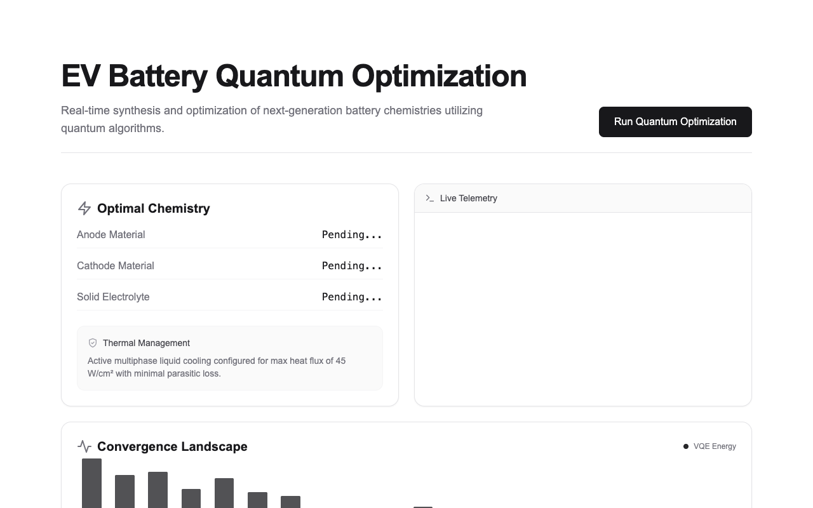

<div align="center">

<picture>
  <source media="(prefers-color-scheme: dark)" srcset="brand/logo-mark.png" />
  <source media="(prefers-color-scheme: light)" srcset="brand/logo-mark-light.png" />
  
</picture>

# TerraScope

[](https://github.com/thrilokm/TerraScope/actions/workflows/ci.yml)
[](LICENSE)
[](CONTRIBUTING.md)
[](https://nextjs.org/)
[](https://threejs.org/)
[](https://terrascope-docs.vercel.app)
[](https://github.com/thrilokm/TerraScope/stargazers)

### A living digital twin of Earth — real physics, real data, no fake numbers.

An interactive 3D globe with daily NASA satellite imagery, a physically-computed day/night terminator you can scrub through time, animated global wind from the latest GFS analysis, click-anywhere forecasts, and a "Living Earth" layer where 1,200 real cities light up along the actual terminator. Plus a **Mars** twin with real orbital mechanics and the measured Viking CO₂ cycle, and a **Virtual Earth** time machine that plays 6,000 years of real city growth across the planet.

[**▶ Live demo**](https://terrascope-ecru.vercel.app) &nbsp;·&nbsp; [**📖 Documentation**](https://terrascope-docs.vercel.app) &nbsp;·&nbsp; [Data sources](docs/DATA_SOURCES.md) &nbsp;·&nbsp; [Architecture](docs/ARCHITECTURE.md) &nbsp;·&nbsp; [Model card](model/output/MODEL_CARD.md) &nbsp;·&nbsp; [Contributing](CONTRIBUTING.md)

> **Run it locally in 30 seconds:** `git clone` → `npm install` → `npm run dev`. No keys, no config. See [Quickstart](#quickstart).



<sub>The live app: real NASA GIBS imagery, a physically-computed terminator, and the data-layer panel. MIT licensed, no API keys required.</sub>

</div>

---

## What makes this different

Most "3D earth" projects are a spinning texture with decorative numbers. This one is wired to real data and real physics end to end, and it is honest about the line between the two:

- **The terminator is computed, not drawn.** `lib/solar.ts` implements the NOAA solar-position algorithm (solar declination + equation of time → subsolar point), unit-tested against known solstice/equinox values. Scrub the time control and day/night moves exactly as the real sun does.
- **The wind is real.** The animated flow is the latest NOAA/NCEP GFS 10 m analysis, refreshed 4×/day, advected by bilinear interpolation of the actual grid (antimeridian wrap included, unit-tested). Only the playback speed is exaggerated so motion is visible at globe scale — the vectors are real.
- **The imagery is today's.** Daily NASA GIBS/Worldview satellite layers — true color, land-surface temperature, precipitation — proxied and cached, walking back a day when a layer hasn't published yet.
- **The forecast model reports honest, held-out accuracy.** A transparent baseline validated on a strict 2025 temporal holdout across 20 cities, with persistence as the reference. It **beats persistence by 9.6% / 15.2% / 17.8%** of MAE at 24/48/72 h — and the [model card](model/output/MODEL_CARD.md) states plainly that it is an educational baseline, **not** a rival to national weather services.
- **Anything simulated is labeled as simulated,** in the UI, right where it appears.
- **No API keys, anywhere.** Every data source is free and keyless. Clone, install, run.

## Features

| | |
|---|---|
| 🌍 **Interactive globe** | react-three-fiber sphere, orbit/zoom, starfield, sun-modulated atmosphere rim |
| 🛰️ **Live NASA layers** | true color · land-surface temp · precipitation · Blue Marble / Black Marble base |
| 🌗 **Physical day/night** | real subsolar point, twilight band to −12°, ±24 h time scrubber |
| 🌬️ **Global wind** | GFS 10 m analysis as GPU-friendly particle flow, refreshed every 6 h |
| 📍 **Click-anywhere forecast** | tap the globe → live 7-day Open-Meteo forecast for that exact point |
| 🏙️ **Living Earth tab** | 1,200 real cities glowing along the terminator; live per-city weather; a clearly-labeled activity simulation from local solar time + population |
| 📊 **Honest forecast baseline** | 20-city ridge model, validated on held-out 2025 data; coefficients exported and fully reproducible |
| 🔴 **Mars tab** | real Mars24 orbital mechanics (Ls, season, Mars clock), computed Mars terminator, measured Viking CO₂ pressure cycle, dust-storm-season climatology, public-domain USGS mosaic |
| ⏳ **Virtual Earth tab** | deep-zoom time machine: 1,730 real cities grow over 6,000 years (Reba et al.), precession-shifted night sky, world population, dated events incl. the World Wars |
| 🌑 **Moon tab** | Meeus-computed phase, illumination, and optical libration; real terminator; LRO Diviner surface-temperature swing (~392 K → ~95 K). No atmosphere, no faked weather |
| 🪐 **Solar System tab** | Keplerian orrery (real orbits) + focus globes for Mercury→Neptune: true axial tilts, Saturn's rings to scale, measured gas-giant zonal winds, Neptune's record gales |
| 🌙 **Moons tab** | major moons by parent with mini-orreries + the live 1:2:4 Laplace resonance; Io volcanism, ocean worlds, Titan's real methane weather, retrograde Triton — measured phenomena only |
| ❄️ **Dwarf planets tab** | trans-Neptunian orrery + Pluto/Charon/Ceres real maps and the three never-visited worlds shown as honest illustrative spheres; Haumea's real triaxial shape + ring |
| ✨ **Exoplanets tab** | 62 real systems from the NASA Exoplanet Archive with to-scale architectures, computed habitable zones, and a Solar-System size comparison; measured parameters, honestly illustrative appearances |
| ☄️ **Comets & asteroids tab** | 45 real JPL small bodies on live animated orbits — interstellar hyperbolic passes, anti-sunward comet tails, factual CNEOS close approaches; real maps for visited bodies, illustrative elsewhere |
| 🔆 **Sun & space-weather tab** | the Sun in six SDO wavelengths + live NOAA SWPC space weather (solar wind, Kp, flares, aurora forecast) + the Solar Cycle 25 chart; measured data and attributed SWPC forecasts, never our own |
| 🌌 **Night-sky tab** | 9,029 real stars (sized by magnitude, colored from measured B–V), 88 constellations + 110 Messier objects + the aligned Milky Way, and a real "sky from your location right now" planetarium mode |
| 💫 **Meteor-showers tab** | 37 real showers (IAU/IMO) — radiants on the sky, a year calendar, "tonight/next up", parent-body links to the comets tab, moon-phase-at-peak; honest ZHR vs observed rate |
| 🛰️ **ISS tracker tab** | the live ISS over the globe via real TLE + SGP4 (true altitude), ground track, sunlit/shadow, and visible passes over your location; element-set age shown, refreshed twice daily |
| 🔭 **Jupiter's moons tab** | the four Galilean moons in a telescope plane-of-sky view at real Meeus positions — live shadow transits (the black dots), eclipses and occultations, a scrub to watch a shadow cross the disk, a predicted-events table, and whether Jupiter is up from your location; times honest to minutes, marker sizes labeled as exaggerated |
| 🪐 **Saturn's moons tab** | the seven major moons strung along Saturn's real tilted rings at cited JPL positions, with the honest headline that shadow transits only cluster near each ~15-year ring-plane crossing (last May 2025); a ring-tilt panel, a coarse events scan, a scrubber spanning both the moons' days and the rings' years, and whether Saturn is up from your location |
| 🌗 **Other moons tab** | Mars, Uranus and Neptune's moons in one telescope view with a planet selector, at cited JPL positions; honest that these tiny disks give no Earth-observable transits, so it leads with the geometry instead (Uranus tipped ~98 degrees, retrograde Triton, Phobos racing around Mars in ~7.65 h) |
| 🌘 **Dwarf moons tab** | the moons of Pluto, Eris, Haumea and Makemake, with two honesty tiers kept distinct: Pluto is a real, precise binary (Charon plus Styx/Nix/Kerberos/Hydra, barycenter outside Pluto, from the post-New-Horizons JPL solution), while Eris/Haumea/Makemake show real cited orbits with an illustrative phase, and Makemake's moon is flagged poorly constrained |
| 🪨 **Asteroid moons tab** | real binary and multiple asteroid systems (Didymos-Dimorphos, Ida-Dactyl, Sylvia and Kleopatra triples, the Antiope and Patroclus doubles) drawn to scale; scrubbing across the 2022 DART impact flips Dimorphos's period by the real 32 minutes; and an honest panel that comets have no moons (67P is a contact binary, one body, not a moon) |
| 🛸 **Interstellar page** | a cinematic experience built on real public-domain NASA/ESA footage (a galactic-center video toward Sagittarius, the Voyager Pale Blue Dot, the Hubble deep field): the three real interstellar visitors (ʻOumuamua, Borisov, 3I/ATLAS) on their true hyperbolic paths, a live swarm-robotics defense game running real boids/consensus algorithms, a subtle original robot guide, and NASA's public-domain "sounds of interstellar space" (zero copyrighted film assets) |
| 🏜️ **Surfaces tab** | stand on Mars: real MOLA terrain of Gale Crater at true meter scale, under the REAL live sun position (Mars24), with the real butterscotch-day / blue-sunset sky story and Curiosity's actual 360° photograph as ground truth; plus Titan's honest twilight (real facts, the one real Huygens photo, illustrative terrain labeled, and the Saturn-visibility truth told straight) |
| 🌌 **Exoplanet Surfaces tab** | the mirror of the Surfaces tab: the SKY is the real, computed part and the ground is honestly imagined. Stand under TRAPPIST-1's giant salmon-red sun (2.17°, four Suns wide) with sibling worlds passing larger than our Moon, Proxima b's red-dwarf sky, and a gas giant with no surface to stand on; all from real NASA Exoplanet Archive data |
| ⚫ **Black Holes tab** | a real catalog (the EHT's Sgr A* and M87*, Cygnus X-1, Gaia BH1, GW150914, TON 618) with a physically-based gravitational-lensing render warping the real Milky Way, exact Schwarzschild geometry whose shadow sizes reproduce the EHT measurements, an interactive time-dilation dial, and the real EHT images (CC BY 4.0) beside our computed shadow |
| 💫 **Neutron Stars tab** | real pulsars (the first pulsar / Joy Division, the Crab and Vela, the most massive, the first-exoplanet host, the double pulsar, the 716 Hz record-holder, a magnetar) as a rotating lighthouse that sweeps and pulses (and, opt-in, sounds) at each one's real measured spin rate, with nuclear-density physics, the stacked-pulse plot, and real Crab/Vela imagery |
| 🌌 **Galaxies & Cosmic Web tab** | the real large-scale structure of the universe: 18,000 actual SDSS galaxies plotted in 3D so the true filaments and voids emerge, a galaxy explorer with real Hubble/JWST imagery and the Hubble classification, Andromeda shown blueshifted and approaching, and a scale zoom from Earth to the 93-billion-light-year observable universe |

## Quickstart

```bash
git clone https://github.com/thrilokm/TerraScope.git
cd TerraScope
npm install
npm run dev      # → http://localhost:3000
```

That's it — no `.env`, no keys, no accounts. Other commands:

```bash
npm run build                     # production build (deploys to Vercel with zero config)
npx vitest run                    # 885 unit tests across 35 files: solar, geo, wind, orbits, physics per world
python scripts/wind/fetch_wind.py # regenerate the wind field locally (needs requests + numpy)
```

New here? The [documentation site](https://terrascope-docs.vercel.app) has a guided
quickstart, a tutorial for adding your own world, the worlds-registry reference,
and the per-world physics and data-source notes.

## Forecast model — real numbers

Pooled over 20 cities, 2025 holdout, ~175k samples per lead. Skill = `1 − MAE_model / MAE_persistence`.

| Lead | Persistence MAE | Climatology MAE | **Ridge MAE** | Ridge skill |
|---|---|---|---|---|
| t+24 h | 1.87 °C | 2.47 °C | **1.69 °C** | **+9.6%** |
| t+48 h | 2.46 °C | 2.47 °C | **2.09 °C** | **+15.2%** |
| t+72 h | 2.73 °C | 2.47 °C | **2.25 °C** | **+17.8%** |

Easy climates score well (Lagos 0.59 °C at 24 h); hard continental ones don't (Denver 2.96 °C) — exactly as physics predicts. Full per-city results, limitations, and reproduction steps: [model card](model/output/MODEL_CARD.md).

## Architecture

The whole thing is built around one constraint: **Vercel hosts only the frontend and thin caching proxies — all heavy compute happens ahead of time, elsewhere.**

- **GitHub Actions cron** decodes GFS GRIB2 → compact JSON every 6 h (pure-Python decoder, no binary deps).
- **Offline Python** trains and validates the forecast model; the browser just runs the exported coefficients.
- **The browser** does solar geometry, particle advection, and model inference — all cheap.
- **Open-Meteo & NASA GIBS** are called directly (CORS, keyless); GIBS snapshots are cached through one Next.js route.

Full reasoning, including why not to run physics on Vercel and what we'd do if we ever needed live server compute: [docs/ARCHITECTURE.md](docs/ARCHITECTURE.md).

**Stack:** Next.js 15 (App Router) · TypeScript · Tailwind v4 · react-three-fiber + drei · three.js · Vitest.

## Data & licensing

Every dataset, its license, and how it's used is logged in [docs/DATA_SOURCES.md](docs/DATA_SOURCES.md) (verified against official sources). Summary: NASA GIBS (CC0), NOAA GFS & Natural Earth (US Gov public domain), Open-Meteo (CC-BY 4.0, attribution shown in-app). No source with unclear or restrictive terms is used.

## Roadmap

- [x] **Phase 1 — Earth.** Live globe, real data layers, physical terminator, wind, forecasts, Living Earth cities.
- [x] **Phase 2 — Mars.** Real Mars24 orbital mechanics (Ls, seasons, Mars clock), a physically computed Mars terminator, the measured Viking seasonal CO₂ pressure cycle, and dust-storm-*season* climatology — on a public-domain USGS Viking mosaic.
- [x] **Virtual Earth — time machine.** A deep-zoomable Earth played through history: 1,730 real cities appearing and growing over 6,000 years (Reba et al. 2016), a precession-shifted night sky, world population, and dated events including the World Wars.
- [x] **Phase 3 — Moon.** No atmosphere, so no fake weather — Meeus-computed phase/illumination, optical libration, a real terminator, and LRO Diviner surface-temperature swings (~392 K day → ~95 K night).
- [x] **Solar System — the other planets.** A Keplerian orrery (real orbits, honestly compressed for visibility) plus click-to-focus globes for Mercury → Neptune: real axial tilts (Uranus on its side), Saturn's rings to scale, measured zonal-wind profiles for the giants, and Neptune's record winds. Orbital mechanics for all; measured data only where it exists; no invented weather.
- [x] **Major moons.** Per-planet mini-orreries (Io whipping around, Triton retrograde) with the live Io–Europa–Ganymede 1:2:4 Laplace-resonance readout, plus focus globes for the nine major moons: Io's volcanism, Europa/Enceladus's subsurface oceans, **Titan's real methane weather** (the one moon that has weather), Triton's nitrogen geysers. Tidal locking and measured phenomena only — texture caveats (Titan's near-IR surface, Triton's synthetic northern hemisphere) surfaced in-app.
- [x] **Dwarf planets.** A trans-Neptunian orrery (real eccentric orbits against a Neptune reference ring; Pluto's 3:2 resonance called out) plus detail views for Pluto, Charon, Ceres, Eris, Haumea, Makemake. Real New Horizons/Dawn maps for the three visited worlds (Pluto's glaciers, Ceres's Occator spots, the Pluto–Charon binary); the three never-visited worlds are **clearly-labeled illustrative spheres — no faked imagery**. Haumea rendered as its real self: a triaxial ellipsoid with a ring.
- [x] **Exoplanets (Beyond).** A system explorer for 62 real systems / 171 planets from the NASA Exoplanet Archive: each system's architecture drawn to scale with its **habitable zone** shaded (computed from the star's luminosity) and our Solar System overlaid for comparison. Per-planet measured parameters (size, mass, period, temperature, distance in light-years, discovery method); appearances are **illustrative — no exoplanet has surface imagery**, and the 7 directly-imaged planets are labeled as unresolved points of light, not maps.
- [x] **Comets & asteroids.** 45 real objects from JPL's Small-Body Database threaded through the inner Solar System on **live animated orbits** (propagated from real elements): closed loops for bound bodies, single hyperbolic passes for the interstellar visitors ('Oumuamua, Borisov), anti-sunward comet tails that flare near the Sun, and a factual close-approaches panel from CNEOS (Apophis's 2029 pass stated straight — naked-eye visible, impact ruled out). Real NASA maps for visited bodies (Eros, Vesta, Bennu), illustrative lumps for the rest; hazard data is factual, never sensational.
- [x] **Sun & space weather.** The Sun in six NASA SDO wavelengths behind a layer switcher (corona to sunspots to magnetic field), with **live space weather fetched in-browser from NOAA SWPC** — solar wind, planetary Kp and storm scale, X-ray flare class, and the aurora forecast — plus the Solar Cycle 25 sunspot chart (shown honestly running hotter than its 2019 forecast). Space weather is a real forecast domain, so we visualize SWPC's own forecasts and attribute them; we don't invent our own.
- [x] **Night sky (Beyond).** A real celestial sphere: 9,029 stars from the HYG catalog (Hipparcos/Gaia), sized by measured magnitude and colored from their measured B–V index, with the 88 constellation figures (a labeled cultural overlay — the stars are real, the lines are ours), 110 Messier deep-sky objects, and the ESO Milky Way panorama rotated into equatorial coordinates so the band lines up with the real star density. A **"sky from your location, right now"** planetarium mode uses the same real observer geometry (local sidereal time) that drives every terminator in the app.
- [x] **Meteor showers.** 37 real showers (IAU Meteor Data Center / IMO) with radiants plotted on the celestial sphere, a year calendar, and a "tonight / next up" panel — knitting three tabs together: each parent body links to the Comets & Asteroids tab (Perseids → Swift-Tuttle, Geminids → asteroid Phaethon, Orionids → Halley), and the moon phase at each peak comes from the Moon tab so you know if moonlight will wash it out. ZHR is labeled as the idealized rate; a real altitude-corrected estimate sits beside it.
- [x] **ISS tracker.** The International Space Station, live: a real orbital element set (public-domain US Space Force TLE via CelesTrak, refreshed twice daily by a GitHub Action) propagated in-browser by **SGP4** to show the station over the Blue Marble globe at its true altitude — which honestly *hugs* the Earth — with its ground track, sunlit/shadow state, and the headline **"visible passes over your location"** (rise/set/max-elevation, computed as the ISS sunlit while you're in darkness). The element-set epoch and age are shown, since SGP4 accuracy degrades with TLE age.
- [x] **Jupiter's moons.** The four Galilean moons (Io, Europa, Ganymede, Callisto) in a telescope plane-of-sky view at their real apparent positions computed from **Meeus's Chapter 44** — with the classic black **shadow transits** falling on the sunlit disk, plus eclipses, transits and occultations detected against Jupiter's oblate disk and umbra. A time scrubber lets you watch a shadow cross; an events table predicts the next transits/eclipses (times honest to ~a minute, a few minutes near quadrature, with a JPL Horizons pointer for observing-grade timing); and observer visibility (via the same celestial geometry that drives the star map) tells you whether Jupiter is above your horizon right now. Moon markers are enlarged for legibility with a true-angular-size toggle, clearly labeled; the method is validated against Meeus's 1992 worked example.
- [x] **Saturn's moons.** Saturn's seven major moons (Mimas, Enceladus, Tethys, Dione, Rhea, Titan, Iapetus) in a telescope plane-of-sky view, at their real positions from the cited **JPL SSD mean elements** (SAT441), oriented by Saturn's real pole and strung along the **tilted rings** (ring geometry from **Meeus's Chapter 45**, validated against the book's 1992 example). The honest headline is *seasonality*: unlike Jupiter, Saturn's moon disk-transits and shadow-transits happen only in a season around each ~15-year ring-plane crossing (the last was 2025-05-06, the next is ~2038), so the tab reads the live ring opening and tells you why the events list is short right now rather than faking events. A coarse events scan (labeled approximate, with a JPL Horizons / IMCCE PHESAT pointer, Iapetus flagged least accurate), a scrubber that spans both the moons' days and the rings' years, and observer visibility. Saturn and ring textures are Solar System Scope (CC-BY 4.0); the moon maps are public-domain Cassini.
- [x] **Other moons (Mars, Uranus, Neptune).** One combined tab with a planet selector, each a telescope plane-of-sky view of that planet's moons at their real positions from the cited **JPL SSD mean elements**, oriented by the planet's IAU pole. Mars (Phobos, Deimos), Uranus (Miranda, Ariel, Umbriel, Titania, Oberon) and Neptune (Triton, Proteus, Nereid). The honest headline: unlike Jupiter, these disks are tiny from Earth (Mars 4 to 25 arcsec, Uranus ~3.7, Neptune ~2.3), so moon transits are rare to unobservable, and the tab is a live *configuration* view that leads with the geometry instead: **Uranus tipped ~98 degrees** with its opening swinging across the 84-year season, **Triton's retrograde** orbit, and **Phobos** circling Mars in ~7.65 h (below synchronous height, spiraling in). Triton and the wildly eccentric Nereid (e=0.75) are flagged least accurate, with a JPL Horizons pointer. Seven new public-domain Viking/Voyager moon maps (Phobos and Deimos irregular; the Uranian five imaged only over their southern hemispheres); Proteus and Nereid are labeled illustrative.
- [x] **Dwarf moons (Pluto, Eris, Haumea, Makemake).** One combined tab with a dwarf-planet selector, honest about two different things. First, these systems are effectively *unresolvable* from Earth (Pluto's disk is ~0.1 arcsec), so it is an orbital-geometry view, not an events tab. Second, the data comes in two tiers, kept visually distinct: **Pluto is a real, precise binary** from the post-New-Horizons **JPL solution (Brozovic & Jacobson 2024)** with Charon plus Styx, Nix, Kerberos and Hydra, rendered around the barycenter that genuinely sits *outside* Pluto (~2128 km out vs Pluto's 1188 km radius, so both bodies wobble around empty space); while **Eris (Dysnomia), Haumea (Hiiaka, Namaka, plus its real ring) and Makemake (MK2)** show real cited orbit size, shape, period and inclination but with the along-orbit phase labeled illustrative, and Makemake's moon additionally flagged as a poorly constrained orbit. Sources: Holler et al. 2021, Ragozzine & Brown 2009, Ortiz et al. 2017, Parker et al. 2016. Reused public-domain New Horizons maps of Pluto and Charon; every other moon is a labeled illustrative marker.
- [x] **Asteroid moons (and the truth about comets).** One combined tab with an eight-system selector, each a schematic face-on view of a real binary or multiple asteroid system with the bodies drawn to scale on their real-size, real-period mutual orbits: **65803 Didymos + Dimorphos** (the DART showcase), **243 Ida + Dactyl** (the first asteroid moon, Galileo 1993), **87 Sylvia** (first triple), **216 Kleopatra** (dog-bone triple), **90 Antiope** and **617 Patroclus + Menoetius** (near-equal doubles that orbit a shared barycenter), **22 Kalliope + Linus** and **45 Eugenia**. The showcase: scrubbing time across the **2022-09-26 DART impact** flips Dimorphos's mutual period from 11.921 h to 11.372 h, the real measured 32-minute change, the first time humanity deliberately altered another body's orbit (Thomas et al. 2023, Daly et al. 2023). The honest headline for the "comet" half: **comets have no moons** (a nucleus is too small to hold one); the tab says so and shows the closest phenomenon, a **contact binary** (67P and the KBO Arrokoth), clearly labeled as one body with two touching lobes, not a moon. Sizes, separations, periods and the DART change are real; the orbit orientation and phase are schematic (these systems are unresolvable from Earth). Reused public-domain maps of Didymos (NASA DART) and Ida (NASA/JPL Galileo); 67P is ESA/Rosetta/NAVCAM (CC-BY-SA 3.0 IGO); everything else is a labeled illustrative shape.
- [x] **Interstellar (a movie-inspired homage, all original/open assets).** A cinematic, multi-section page that leans into the mood of the film without using a single copyrighted film asset: no Hans Zimmer score, no TARS, no movie scenes. Three sections: an **Arrival** onboarding intro; **The Visitors**, a 3D view of the three confirmed interstellar objects (1I/ʻOumuamua 2017, 2I/Borisov 2019, and the 2025 newcomer 3I/ATLAS) on their **real hyperbolic trajectories** from cited JPL data, each with an asymptote pointing back to where it came from (3I/ATLAS from Sagittarius) and a scrubber through perihelion; and **Swarm Defense**, a live interactive game running **real swarm-robotics algorithms** (Reynolds boids, decentralized task allocation, local consensus), clearly labeled as an educational model and not a real defense system. An original monolith-style robot guides you, and the ambient audio is NASA's public-domain Voyager "sounds of interstellar space" (off by default, credited). Trajectories are osculating two-body (cross-check JPL Horizons); everything cinematic is original or open-licensed and labeled.
- [x] **Surfaces (stand on Mars and Titan).** The app's first ground-level view. **Mars is the fully real tier**: the terrain is real **NASA MOLA topography of Gale Crater and Mount Sharp** at true meter scale (16-bit elevation decoded in the browser, vertical exaggeration off by default and labeled when on), under the **real live sun position** computed from the validated Mars24 machinery (real local time, sol, Ls, season), with the real sky story rendered and labeled as an artistic rendering: butterscotch days and **blue sunsets** (the reverse of Earth; observational basis Curiosity sol 956), plus a landmark button that jumps to the real next sunset. A panorama mode swaps in **Curiosity's actual 360° photograph** (PIA25407, sol 3509, mapped as the cylindrical projection it is). **Titan is the honest-cinematic tier**: labeled illustrative terrain under real measured facts (94 K, 1.5 bar, ~0.1% of Earth's daylight, methane drizzle), the one real **Huygens surface photo** (credit NASA/JPL/ESA/University of Arizona), and the Saturn truth told straight: Saturn spans **5.65° of Titan's sky** (~11 Moons wide) but sits *below the horizon* at the real Huygens landing site, so the big-Saturn view uses an explicitly labeled Saturn-facing viewpoint with a haze caveat. "Live" means live simulation; no streaming camera exists on any planetary surface, and the tab says so.
- [x] **Exoplanet Surfaces (real alien skies, honestly imagined ground).** The mirror image of the Surfaces tab, and the tab says so: there the ground was real and the sky was rendered; here the SKY is the real, cited part and the ground is entirely illustrative, because **no exoplanet surface has ever been imaged**. From real NASA Exoplanet Archive parameters (already in the repo) it computes what you would actually see standing on four worlds: **TRAPPIST-1e** (its 2566 K host star fills 2.17°, about four Suns wide and deep salmon-red, with siblings f and d appearing larger than our Moon), **Proxima Centauri b** (nearest exoplanet, red-dwarf sun, tidal locking labeled an inference), **TOI-700 d** (a temperate rocky world), and **51 Pegasi b** (a gas giant, the honest no-surface counterpart: nowhere to stand, said plainly). Real: star apparent size and color, sibling discs, surface gravity, irradiance, equilibrium temperature, year length. Illustrative and labeled: all terrain, and the tidal-lock day/night (an inference). No local clock is shown, because rotation is not measured for these worlds, only the year is.
- [x] **Black Holes (real physics, honest lensing).** A real catalog with exact general-relativity geometry and a physically-based gravitational-lensing view as the centerpiece. The objects are all real and cited: **Sagittarius A*** and **M87*** (the two the Event Horizon Telescope actually imaged), **Cygnus X-1**, **Gaia BH1** (nearest known), **GW150914** (the first LIGO merger), and **TON 618** (ultramassive). The computed physics is validated against reality: the Schwarzschild shadow angular size reproduces the EHT's measured ~52 microarcsec (Sgr A*) and ~42 (M87*) from mass and distance alone, and light deflection reproduces the classic 1.75 arcsec solar-limb test. An interactive dial shows gravitational time dilation ("1 second here = X seconds far away"), and a panel shows the real, counterintuitive tidal result (stellar holes are lethal before the horizon, supermassive holes gentle at it). The lensing render is our own GPU shader bending the real ESO Milky Way panorama with the exact point-mass lens equation (real Einstein-ring magnification), with a shadow and photon ring at their true sizes and an illustrative accretion disk wrapping over and under the hole (the honest Gargantua look). The real EHT images (CC BY 4.0, EHT Collaboration, radio reconstructions not optical photos) sit beside the computed shadow. Non-spinning Schwarzschild geometry, Kerr spin flagged for M87*; Hawking radiation shown as real theory, unobserved.
- [x] **Neutron Stars & Pulsars (the lighthouse, at the real rate).** A rotating neutron star whose misaligned magnetic beams sweep and pulse at each pulsar's real measured period, seen and heard. The catalog is real and cited (ATNF Pulsar Catalogue plus discovery papers): **PSR B1919+21** (the first pulsar, Bell Burnell 1967, whose stacked pulses are the Joy Division album cover), the **Crab** and **Vela** pulsars, **PSR J0740+6620** (most massive, ~2.08 Msun, NICER radius), **PSR B1257+12** (host of the first exoplanets ever found), the **J0737-3039 double pulsar**, **PSR J1748-2446ad** (fastest known, 716 Hz), the magnetar **SGR 1806-20**, and **PSR B1937+21** (first millisecond pulsar). Computed and validated: spin frequency (Crab 29.76 Hz, Vela 11.2 Hz, the record-holder at 1.396 ms), nuclear density (a sugar cube weighing about a billion tonnes), ~1.3e11-g surface gravity, escape velocity 0.587c, the magnetic-field ladder up to a magnetar's 1e15 gauss, and characteristic age (with the honest note that the Crab's spin-down age slightly overestimates its true SN-1054 age). The one honest split: the pulse timing is real (plot and audio use the true period), while the mesh's visual spin is scaled so a 716 Hz pulsar does not blur, and that is labeled. The pulse audio is synthesized in the browser at the real spin frequency (opt-in, off by default; on-screen flash capped at 4 Hz for photosensitivity while the true rate drives the plot and audio). Plus the iconic Joy Division stacked-pulse plot and the real Crab (ESA/Hubble, CC BY 4.0) and Vela (NASA/CXC) images. Canonical 1.4 Msun / 12 km assumed and flagged where mass and radius are not individually measured.
- [x] **Galaxies & Cosmic Web (the real large-scale structure).** A galaxy explorer plus a 3D cosmic web built from a real galaxy redshift survey. The centerpiece plots **18,000 actual SDSS DR17 galaxies** (Abdurro'uf et al. 2022) in 3D via each one's real position and Hubble-law distance, so the genuine filaments, walls, and voids of the nearby universe emerge, with our position at the origin. Labeled honestly: the radial axis is redshift-space, so the "fingers of God" cluster elongation is real; the survey is a thin wedge; and the depth scale shifts with the unresolved **Hubble tension** (Planck 67.4 vs SH0ES 73, we adopt 70). A real galaxy catalog (Milky Way, Andromeda and Triangulum shown blueshifted and *approaching*, the Magellanic Clouds, M87, Sombrero, Whirlpool, NGC 1300, Centaurus A) with the Hubble tuning-fork classification and real ESA/Hubble imagery, a scale ladder from Earth to the 93-billion-light-year observable universe with the Laniakea supercluster and Sloan Great Wall, and the real JWST SMACS 0723 first deep field (nearly every dot a galaxy, its light billions of years old). All imagery CC BY 4.0, credited. *(this release)*

Next up (optional): richer per-body measured layers as open data allows.

Contributions welcome — see [CONTRIBUTING.md](CONTRIBUTING.md). The honesty rule is non-negotiable: every number on screen traces to a data source or a documented calculation.

## Cite this project

If TerraScope is useful in your research, teaching, or writing, please cite it. A machine-readable [`CITATION.cff`](CITATION.cff) is included, so GitHub's "Cite this repository" button generates APA/BibTeX for you.

## License & attribution

Code: [MIT](LICENSE). Imagery courtesy NASA EOSDIS GIBS / Worldview and NASA Earth Observatory. Weather data by [Open-Meteo.com](https://open-meteo.com/) (CC-BY 4.0). Wind from NOAA/NCEP GFS (public domain). Cities from [Natural Earth](https://www.naturalearthdata.com/) (public domain) and Reba, Reitsma & Seto 2016 (CC-BY 4.0). ERA5 via Open-Meteo — Copernicus Climate Change Service / ECMWF (DOI 10.24381/cds.adbb2d47). Planetary/lunar maps from NASA/JPL/USGS (public domain); Saturn, Uranus, Neptune and Saturn-ring textures by [Solar System Scope](https://www.solarsystemscope.com/) (CC-BY 4.0). Zonal winds: Barrado-Izagirre et al. 2013 (Jupiter), García-Melendo et al. 2011 (Saturn), Sromovsky et al. 1993 (Neptune). Full per-source detail in [docs/](docs/). Not affiliated with or endorsed by NASA, NOAA, or JPL.

## Star history

If this project is useful to you, a star helps others find it.

[](https://star-history.com/#thrilokm/TerraScope&Date)
